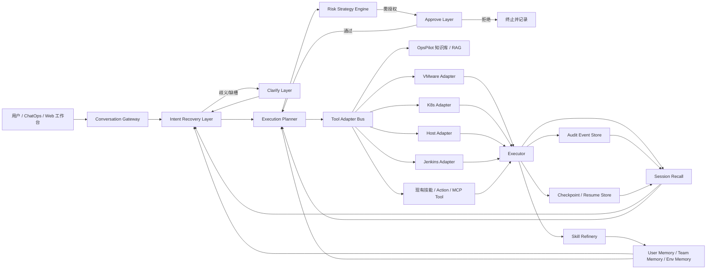
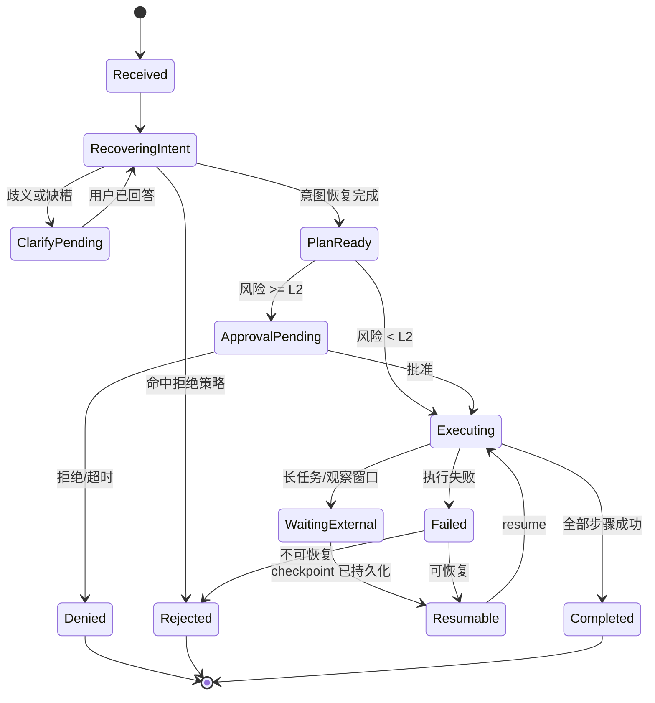

# OpsPilot Codex 开发说明书正式版

## 执行摘要

本说明书的核心结论只有一句话：**OpsPilot 现在最应该优先补的是“结构化意图恢复 + 双交互护栏”，而不是先继续调大模型参数。** 从公开可核验的 OpsPilot 基线看，它已经具备“基于 Intent 的运维能力整合”、本地/联网知识问答、Redis 配置、向量检索与 Jenkins 集成等能力；从官方产品文档看，又进一步演进到了知识库、工具、智能体、K8s/Jenkins 集成与 MCP 工具接入的企业化形态。Hermes 则把另一条线走得非常完整：它把 agent 运行时拆成会话状态、技能沉淀、记忆注入、会话检索、工具注册、澄清交互、危险操作审批和可恢复执行这些独立机制，并通过统一网关与状态库把它们串起来。对于 OpsPilotEnterprise 来说，最有价值的不是“照搬 Hermes UI”，而是把 Hermes 的**learning loop / memory / skill / tool loop**方法拆出来，内嵌到一个更偏运维编排的执行外壳中。citeturn41search1turn42search1turn42search2turn16search0turn43view0

因此，本说明书建议在 OpsPilotEnterprise 之上新增一个**旁挂式 TypeScript Orchestrator**，置于现有知识库、技能、工具和执行器之前，专门负责两层能力：其一是 **Intent Recovery Layer**，把用户的自然语言从“模糊需求”恢复为“可执行、可审计、可回滚”的标准化运维意图；其二是 **Clarify/Approve 双交互层**，把“事实性澄清”和“风险性授权”彻底分开，避免模型把审批当成补槽，也避免把澄清误当授权。这一设计直接借用了 Hermes 主仓库里已经成熟的 `clarify_tool.py`、`approval.py`、`session_search_tool.py`、`skill_manager_tool.py`、`memory_manager.py`、`context_engine.py` 与 `hermes_state.py` 所体现出的运行时分层方法。citeturn35view3turn27view0turn31view6turn31view9turn20view3turn23view1turn33view0

落到交付层面，本说明书给出的不是概念图，而是一份可以直接交给开发团队与 Codex 执行的规格：包含对比表、可复用组件清单、总体架构、TypeScript 接口、数据库表、状态机、API 规范、前端交互卡片、审计与 resume 设计、风险策略引擎、单元测试样例、三类运维场景流程与 JSON，以及实施里程碑、验收标准与时间估算。

## 证据边界与基线判断

本次源码证据主要来自 entity["company","GitHub","software platform"] 主仓库、entity["company","Gitee","software platform"] 镜像与官方产品文档；Hermes 侧以 entity["organization","Nous Research","ai research org"] 的官方 README、目录结构、发布页与源码文件注释为主；OpsPilot 侧则以公开可核验的上游 README、BlueKing Lite 产品介绍与版本日志、以及官方发布内容为主。由于本次公开深研能够稳定核验到的是 OpsPilot 的公开 README 与产品文档，而不是 miracies/OpsPilotEnterprise 全量源码页，所以**凡无法从公开资料直接核验的企业版内部文件、类名、表名与路由，本文一律标注“未指定”**，并以“旁挂式接入”作为默认实现策略。citeturn41search1turn42search1turn42search2turn42search6turn16search0

就研究基线而言，公开 README 明确显示 OpsPilot 仍保留较强的 Rasa/Intent 传统：通过 `ops_pilot_cli.py` 进行初始化、知识索引与查询，运行 `rasa run` 与 `rasa run actions` 两类服务，并通过 `credentials.yml` 配置 WebSocket/JWT；同一份 README 又说明它具备本地知识问答、联网知识问答、向量库与倒排索引、Redis Prompt 配置和 Jenkins 技能开关。与此同时，BlueKing Lite 的官方资料说明产品形态已经扩展到知识库、工具、智能体、K8s/Jenkins 工具、MCP 工具接入、文档提取与分块策略等更通用的平台结构。也就是说，**OpsPilot 的现实问题不是“没有能力”，而是“运行时结构没有把能力做成稳定的决策流水线”**。citeturn41search1turn42search1turn42search2turn42search6

Hermes 侧的资料则非常清楚地表明：它把 agent 运行时分成了 `agent/`、`tools/`、`gateway/`、`skills/`、`tests/` 等层；其中工具层存在明确的注册中心、澄清工具、审批工具、技能管理、会话检索，agent 层存在记忆管理、上下文压缩与可插拔上下文引擎，状态层存在基于 SQLite + WAL + FTS5 的会话数据库，而网关层则负责 `/approve`、`/deny`、会话上下文与恢复。对 OpsPilotEnterprise 的最大启发，恰恰在于这种**把“模型提示词”之外的运行时责任显式模块化**的方式。citeturn43view0turn43view1turn43view2turn43view3turn20view3turn23view1turn33view0turn38view0

## 两个代码库的关键模块对比与可复用清单

### 关键模块与实现对比

| 能力面 | OpsPilot 公开基线 | Hermes 主仓库 | 对正式版的结论 |
|---|---|---|---|
| 运行入口 | README 明确了 `ops_pilot_cli.py` 的 `init_data`、`embed_local_knowledge`、`query_embed_knowledge`，以及 `rasa run`、`rasa run actions` 两类服务入口；部署目录指向 `support-files/`。 citeturn41search1 | 根目录显式拆分为 `agent/`、`gateway/`、`tools/`、`skills/`、`tests/`，其中消息入口在 `gateway/run.py`，会话上下文在 `gateway/session.py`。 citeturn43view0turn43view2 | OpsPilotEnterprise 应新增独立 orchestrator，而不是把恢复、澄清、审批、执行全塞进现有 Action 或单一 prompt。 |
| 意图理解 | README 直接写明“支持基于 Intent 的运维能力整合”；产品文档又把能力扩展到知识问答、ChatOps、智能引导。具体企业版 intent 文件路径未指定。 citeturn41search1turn42search1 | Hermes 不走经典 Rasa NLU 路线，而是依赖系统提示、会话检索、记忆注入、技能与工具执行纪律来恢复任务含义。`prompt_builder.py` 明确要求工具优先、默认解释先执行、必要时才澄清。 citeturn20view0turn20view2turn16search0 | 对运维平台而言，最优方案是保留域内意图库，同时在其上方加一个“恢复层”做候选生成、补槽、证据绑定和歧义裁决。 |
| 工具接入 | README 已公开 Jenkins 能力及环境变量；官方版本日志显示 v3.3 工具接入改为 MCP，v3.4 内置 K8s/Jenkins 工具。 citeturn41search1turn42search2turn42search0 | `tools/registry.py` 采用模块级自注册；`tools/` 下有 `approval.py`、`clarify_tool.py`、`session_search_tool.py`、`skill_manager_tool.py`、`terminal_tool.py` 等。 citeturn34view2turn43view1turn35view3turn31view6turn31view9 | OpsPilotEnterprise 应把“工具目录、工具元数据、风险等级、审批要求、适用环境”统一纳入注册表。 |
| 知识与检索 | README 显示本地知识问答、联网知识问答、`VEC_DB_PATH`、`INDEXER_DB_PATH`；官方文档进一步说明知识处理已演进为“提取 + 分块 + 增强”的 RAG 预处理体系。 citeturn41search1turn42search6 | Hermes 更偏“会话记忆 + 过去会话检索 + 技能记忆”，`session_search_tool.py` 明确通过 SQLite FTS5 做会话检索，再用廉价模型做摘要。 citeturn31view6turn34view0turn33view0 | OpsPilot 的文档 RAG 保留不动，但应新增“运行态记忆检索”，用来恢复近期操作上下文与用户偏好。 |
| 记忆与学习闭环 | README 可见的是 Redis Prompt 配置、MySQL Tracker FAQ、知识问答与故障引导；公开资料中没有完整的“自生成技能 + 自修补技能”闭环。 citeturn41search1 | `memory_manager.py` 负责内置+外部记忆提供者编排；`skill_manager_tool.py` 支持 create / patch / edit / delete / write_file / remove_file；README 明确宣称 learning loop、memory、skills 和 session search。 citeturn20view3turn34view1turn16search0turn31view9 | OpsPilotEnterprise 应把“故障处置成功经验”沉淀为 skill，而不是只沉淀到知识库或聊天历史。 |
| 上下文治理 | 公开 OpsPilot 仅能核验到 `LLM_MAX_HISTORY` 等参数，长上下文压缩/恢复机制未指定。 citeturn41search1 | `context_engine.py` 提供可插拔上下文引擎接口，默认实现是 `context_compressor.py`。 citeturn23view1turn17view0 | Intent 层、Clarify/Approve 层和执行层应共享统一的上下文预算与压缩协议，避免“长链路后模型忘掉前文”。 |
| 安全交互 | OpsPilot 公共资料强调 ChatOps、自动化引导、工具接入，但没有单独公开的审批层说明。相关实现路径未指定。 citeturn42search1turn42search2 | `approval.py` 内置危险命令模式、会话级审批状态、永久 allowlist；`gateway/run.py` 实现 `/approve` 与 `/deny`。`clarify_tool.py` 则把“澄清问题”独立成正式工具。 citeturn27view0turn38view0turn35view3 | 必须把“澄清”和“授权”拆开；这是本文最重要的实现要求。 |
| 会话持久化与恢复 | 公开资料能核验到 Redis、MySQL Tracker 和会话式问答，但 resume 机制未指定。 citeturn41search1 | `hermes_state.py` 使用 SQLite + WAL + FTS5 保存 session/messages；发布页还明确提到 `/resume`、session lineage、session DB 与跨会话搜索。 citeturn33view0turn21search1turn39search0 | OpsPilotEnterprise 需要可重放的 audit log + checkpoint，而不能只依赖聊天历史。 |

综合判断很明确：**OpsPilot 强在运维域模型、知识与企业工具；Hermes 强在 agent 运行时结构、可恢复性与闭环沉淀。正式版必须做“OpsPilot 的域能力 + Hermes 的运行时骨架”的组合，而不是简单替换其中一方。** citeturn41search1turn42search1turn42search2turn16search0turn33view0

### 可复用组件清单

| Hermes 组件 | 关键文件 | 复用方式 | 优先级 |
|---|---|---|---|
| 工具注册中心 | `tools/registry.py` citeturn34view2turn36view2 | 作为 OpsPilotEnterprise 统一工具目录与调用总线蓝本，补充 `riskLevel`、`approvalMode`、`resourceScope`、`rollbackable` 元数据 | 高 |
| 澄清工具 | `tools/clarify_tool.py` citeturn35view1turn35view3 | 直接仿制其“问题 + 最多 4 个选项 + Other”设计，映射到前端卡片与消息通道 | 高 |
| 危险操作审批 | `tools/approval.py` + `gateway/run.py` citeturn27view0turn38view0 | 复用“危险模式识别 + 会话级阻塞队列 + once/session/always 作用域”思路，但企业版需弱化 `always` 在生产环境的适用范围 | 高 |
| 会话数据库 | `hermes_state.py` citeturn33view0 | 复用“WAL + FTS5 + session/message 分表 + lineage”思路，迁移到企业数据库与审计表 | 高 |
| 会话检索 | `tools/session_search_tool.py` citeturn31view6turn34view0 | 作为 resume、重复告警分析、相似故障建议的回忆层 | 中高 |
| 技能管理 | `tools/skill_manager_tool.py` citeturn31view9turn34view1 | 复用“成功经验沉淀为 procedural memory”的机制，在 Ops 侧改名为 Playbook/Runbook Skill | 高 |
| 记忆编排 | `agent/memory_manager.py` citeturn20view3turn20view4 | 复用“内置提供者 + 外部提供者”模式，把用户偏好、环境偏好、历史约束与工作台偏好分层 | 中 |
| 上下文引擎 | `agent/context_engine.py` + `agent/context_compressor.py` citeturn23view1turn17view0 | 作为长链故障排查、多轮审批与多阶段执行的上下文预算器 | 中 |
| 技能元数据工具 | `agent/skill_utils.py` + `agent/skill_commands.py` citeturn23view2turn23view3 | 用于前端技能目录、平台过滤、技能 frontmatter 解析和 `/plan` 式中间工件管理 | 中 |

## 总体架构与设计原则

从公开基线看，OpsPilot 已经同时拥有“意图驱动”“知识驱动”“工具驱动”三类能力，并且企业化版本已经引入 MCP 工具接入、K8s/Jenkins 内置工具、智能体模板与更细粒度的知识预处理；Hermes 则证明，真正让系统稳定工作的关键，不是再往系统提示里加更多规则，而是把这些能力通过独立的运行时模块串成固定流水线。正式版因此不建议替换现有知识库、技能、工具或 ChatOps 入口，而建议在它们之前新增一个 **TypeScript Orchestrator**，把“恢复意图 → 澄清 → 风险评估 → 审批 → 计划 → 执行 → 记录 → 恢复 → 技能沉淀”做成标准路径。citeturn42search1turn42search2turn41search1turn16search0turn43view1turn43view2

下图是正式版建议的总体架构。它不是“推翻重建”，而是“保留现有 OpsPilot 资产，在执行前插入两层结构化护栏，在执行后补上可审计与可恢复骨架”。



对应到仓库落地，建议把新模块作为旁挂目录接入，而不是先大改现有业务代码：

```text
apps/opspilot-orchestrator/
  src/
    modules/
      intent-recovery/
        intent-recovery.controller.ts
        intent-recovery.service.ts
        intent-ontology.ts
        intent-scorer.ts
        slot-extractor.ts
      interactions/
        clarify.service.ts
        approve.service.ts
        interaction.controller.ts
      policy/
        risk-policy.engine.ts
        risk-policy.rules.ts
      planner/
        execution-planner.service.ts
        rollback-planner.service.ts
      audit/
        audit.service.ts
        checkpoint.service.ts
        resume.service.ts
      memory/
        session-recall.service.ts
        runbook-skill.service.ts
      adapters/
        opspilot-knowledge.adapter.ts
        opspilot-tool-registry.adapter.ts
        vmware.adapter.ts
        k8s.adapter.ts
        host.adapter.ts
        jenkins.adapter.ts
    shared/
      types/
      dto/
      utils/
  migrations/
  tests/
```

正式版建议遵守四条原则。第一，**结构先于模型**：先做恢复、审批和审计骨架，再调提示词与 rerank。第二，**澄清与授权解耦**：Clarify 只解不确定性，Approve 只处理副作用和风险。第三，**计划先于执行**：任何 L2 以上动作都必须先形成 plan、scope、rollback。第四，**沉淀先于遗忘**：成功的复杂排障流程要自动归档为 runbook skill，而不是留在单次对话里。上述四条，本质上分别对应了 OpsPilot 现有的意图/知识/工具基础，与 Hermes 运行时里的技能、记忆、审批、会话数据库和上下文引擎。citeturn41search1turn42search1turn20view0turn20view3turn27view0turn33view0

## Intent Recovery Layer 设计

OpsPilot 的公开 README 已把“基于 Intent 的运维能力整合”写得很直接，但企业形态又已经扩展到 K8s、Jenkins、知识库、MCP 工具与智能体模板。这意味着传统“单轮 utterance → 单个 domain intent”的做法已经不够了：正式版需要一个**恢复层**，把一句话恢复成**可执行语义对象**，而不是只给出一个意图标签。Hermes 的启发在于，它把任务理解建立在工具纪律、会话回忆、长期记忆和 procedural skills 之上，而不是单一分类器之上。对 OpsPilotEnterprise 来说，最佳实现就是把“域内意图库”与“运行态回忆/证据绑定”合并。citeturn41search1turn42search2turn20view0turn20view3turn34view0

### 职责边界

Intent Recovery Layer 只做五件事：一是把用户话语归一化；二是生成多个**候选运维意图**；三是补齐或标注缺失槽位；四是尽量通过只读发现、知识库、会话回忆和资源目录来自动补证据；五是决定该请求是“直接进入计划”“发起澄清”还是“直接拒绝”。它**不得**直接执行有副作用动作，也不负责审批。这样做的好处，是把“理解错误”与“执行错误”分开统计、分开调优。

### 意图本体与评分规则

建议先建立一份显式意图本体，而不是把全部理解责任交给模型。最小可用集合如下：

| 领域 | 典型意图 | 关键槽位 |
|---|---|---|
| `vmware` | `power_on_vm` / `power_off_vm` / `restart_vm` / `snapshot_vm` / `clone_vm` | `vcenter`, `cluster`, `folder`, `vmName`, `environment` |
| `k8s` | `get_pod_status` / `rollout_restart` / `scale_deployment` / `drain_node` / `get_logs` | `cluster`, `namespace`, `workloadType`, `workloadName`, `replicas`, `container` |
| `host` | `service_restart` / `service_reload` / `check_disk` / `clean_logs` / `tail_log` | `host`, `service`, `path`, `environment` |
| `jenkins` | `list_jobs` / `build_job` / `read_build_log` / `analyze_build_log` | `jobName`, `branch`, `buildNumber`, `environment` |
| `knowledge` | `ask_rag` / `find_runbook` / `lookup_past_incident` | `query`, `sourceScope` |

评分建议采用**双阶段**：第一阶段由符号规则做候选召回，第二阶段由轻量 LLM 或 reranker 做重排。这样可以最大化利用 OpsPilot 既有领域资产，同时避免“先调模型”的路线把问题拖成纯提示工程。默认建议阈值如下：

- `recoverScore >= 0.78` 且第一候选与第二候选分差 `>= 0.15`：直接恢复；
- `0.55 <= recoverScore < 0.78`，或分差不足：进入 Clarify；
- 任一关键槽位缺失且无法通过只读发现补齐：进入 Clarify；
- 命中违禁操作、越权资源或策略黑名单：直接拒绝。

### TypeScript 类型定义

```ts
export type IntentDomain = "vmware" | "k8s" | "host" | "jenkins" | "knowledge" | "unknown";
export type RecoveryDecision = "recovered" | "clarify_required" | "rejected";
export type RiskLevel = "L0" | "L1" | "L2" | "L3" | "L4";

export interface SlotValue {
  name: string;
  value: string | number | boolean | string[] | null;
  source: "user" | "memory" | "cmdb" | "tool_discovery" | "inferred";
  confidence: number;
}

export interface EvidenceRef {
  type: "session" | "knowledge" | "cmdb" | "tool_discovery";
  refId: string;
  summary: string;
  score: number;
}

export interface IntentCandidate {
  intentCode: string;
  domain: IntentDomain;
  action: string;
  description: string;
  score: number;
  scoreBreakdown: {
    rules: number;
    entityMatch: number;
    slotCompleteness: number;
    memoryBoost: number;
    llmRerank: number;
  };
  slots: SlotValue[];
  missingSlots: string[];
  inferredEnvironment?: string;
  inferredRiskLevel?: RiskLevel;
  evidence: EvidenceRef[];
}

export interface IntentRecoveryRun {
  runId: string;
  conversationId: string;
  userId: string;
  rawUtterance: string;
  normalizedUtterance: string;
  candidates: IntentCandidate[];
  chosenIntent?: IntentCandidate;
  decision: RecoveryDecision;
  clarifyReasons: string[];
  rejectedReasons: string[];
  createdAt: string;
}
```

### 对外接口

```ts
export interface IntentRecoveryService {
  recover(input: {
    conversationId: string;
    userId: string;
    utterance: string;
    channel: string;
    tenantId?: string;
  }): Promise<IntentRecoveryRun>;
}
```

### API 规范

**请求**

```http
POST /api/v1/intent/recover
Content-Type: application/json
```

```json
{
  "conversationId": "conv_20260417_001",
  "userId": "u_ops_01",
  "channel": "wecom",
  "utterance": "把 payment 生产集群滚一下，先看有没有不健康的 pod"
}
```

**响应**

```json
{
  "runId": "ir_01JSX9Q3M9Q3V3",
  "decision": "clarify_required",
  "clarifyReasons": ["cluster is ambiguous", "workloadName is missing"],
  "candidates": [
    {
      "intentCode": "k8s.rollout_restart",
      "domain": "k8s",
      "action": "rollout_restart",
      "score": 0.73,
      "slots": [
        { "name": "environment", "value": "prod", "source": "user", "confidence": 0.99 }
      ],
      "missingSlots": ["cluster", "namespace", "workloadName"],
      "inferredRiskLevel": "L2",
      "evidence": [
        {
          "type": "session",
          "refId": "sess_20260410_x",
          "summary": "最近 7 天你多次操作 payment 命名空间",
          "score": 0.66
        }
      ]
    }
  ]
}
```

### 数据库表设计

下面的表只覆盖恢复层；审计、审批与恢复表在下一节给出。数据库引擎如未指定，建议优先落地 MySQL 8；若现网为 PostgreSQL，可按相同字段映射。

```sql
CREATE TABLE op_intent_runs (
  id                BIGINT PRIMARY KEY AUTO_INCREMENT,
  run_id            VARCHAR(64) NOT NULL UNIQUE,
  conversation_id   VARCHAR(64) NOT NULL,
  user_id           VARCHAR(64) NOT NULL,
  channel           VARCHAR(32) NOT NULL,
  tenant_id         VARCHAR(64) NULL,
  raw_utterance     TEXT NOT NULL,
  normalized_text   TEXT NOT NULL,
  decision          VARCHAR(32) NOT NULL,
  chosen_intent     VARCHAR(128) NULL,
  clarify_reasons   JSON NULL,
  rejected_reasons  JSON NULL,
  created_at        DATETIME NOT NULL DEFAULT CURRENT_TIMESTAMP,
  INDEX idx_conv_user (conversation_id, user_id),
  INDEX idx_created_at (created_at)
);

CREATE TABLE op_intent_candidates (
  id                BIGINT PRIMARY KEY AUTO_INCREMENT,
  run_id            VARCHAR(64) NOT NULL,
  rank_no           INT NOT NULL,
  intent_code       VARCHAR(128) NOT NULL,
  domain_name       VARCHAR(32) NOT NULL,
  action_name       VARCHAR(64) NOT NULL,
  score             DECIMAL(5,4) NOT NULL,
  score_breakdown   JSON NOT NULL,
  slots_json        JSON NOT NULL,
  missing_slots     JSON NULL,
  evidence_json     JSON NULL,
  inferred_risk     VARCHAR(8) NULL,
  created_at        DATETIME NOT NULL DEFAULT CURRENT_TIMESTAMP,
  UNIQUE KEY uk_run_rank (run_id, rank_no),
  INDEX idx_run_id (run_id)
);
```

### Codex 实施要点

Codex 在这一层的任务不是“写一个神奇分类器”，而是按顺序交付三块代码：`intent-ontology.ts`、`slot-extractor.ts`、`intent-scorer.ts`。第一块负责定义域内意图清单与槽位规则；第二块负责从文本、会话记忆和资源目录提槽；第三块负责把规则分、补槽分、证据分和 LLM 重排分合成为最终决策。**先把可解释评分链跑通，再考虑做模型蒸馏或 SFT。**

## Clarify/Approve 双交互层设计

Hermes 在这一部分给出的启发非常直接。`clarify_tool.py` 把“向用户要更多信息”做成了一个正式工具，支持开放式问题或最多 4 个选项，且 UI 自动提供 “Other” 入口；`approval.py` 则把危险命令检测、会话级审批状态、永久 allowlist、网关阻塞队列统一收在一个模块中，而 `gateway/run.py` 负责处理 `/approve` 和 `/deny` 来唤醒被阻塞的 agent 线程。也就是说，Hermes 明确把“听不懂”和“有风险”拆成了两套交互语义。正式版必须完整继承这一点。citeturn35view1turn35view3turn27view0turn38view0turn21search1

### 交互语义

**Clarify** 的目的只有三个：消除歧义、补齐关键槽位、让用户在多个合法候选中做选择。Clarify 不能授权任何副作用动作，即便用户在 Clarify 里点了某个选项，也只意味着“理解完成”，不意味着“批准执行”。

**Approve** 的目的只有两个：确认副作用范围、确认风险接受。Approve 不能补槽；如果 resource scope 还没确定，就必须退回 Clarify。Approve 的展示内容必须包含计划摘要、目标资源、影响范围、执行步骤、回滚方案、风险原因和审批作用域。

### 风险策略引擎

Hermes 的 `approval.py` 已经证明，危险模式检测不该散落在各工具里，而应有单独的规则中心。正式版建议引入 `RiskStrategyEngine`，统一基于**意图、环境、资源范围、动作类别、命令预览、凭据级别、作业窗口**来出风险级别。

建议默认分为五级：

| 风险级别 | 含义 | 示例 | 行为 |
|---|---|---|---|
| L0 | 纯只读 | 查 Pod、查日志、查构建结果 | 直接执行 |
| L1 | 边界明确的低风险写操作 | 非生产环境单对象 scale up 1 个副本 | 默认可执行，记录审计 |
| L2 | 受控变更 | 生产服务重启、灰度扩缩容、单 VM 重启 | 必须 Approve once |
| L3 | 高风险变更 | 生产多资源批量重启、节点驱逐、快照后关机 | 必须 Approve，附 rollback |
| L4 | 破坏性或越权动作 | 删除资源、停数据库、批量删日志、危险 shell 模式 | 默认拒绝或需要工单编号 + 二次确认 |

默认策略要明显比 Hermes 更保守：Hermes 面向通用 agent，允许 `once/session/always`；OpsPilotEnterprise 面向企业运维，建议生产环境**只开放 `once` 与有时限的 `session`，禁止 `always` 永久放行**。这一点是从通用 agent 向企业运维的必要收敛。Hermes 的原始实现可以作为行为模型，但不能直接照抄权限策略。citeturn27view0turn38view0

### 风险规则 TypeScript 定义

```ts
export interface RiskPolicyRule {
  id: string;
  enabled: boolean;
  priority: number;
  matcher: {
    domain?: IntentDomain[];
    action?: string[];
    environment?: Array<"dev" | "test" | "staging" | "prod">;
    resourceScope?: Array<"single" | "multiple" | "cluster" | "global">;
    tool?: string[];
    commandRegex?: string[];
  };
  decision: {
    riskLevel: "L0" | "L1" | "L2" | "L3" | "L4";
    requireClarify?: boolean;
    requireApproval?: boolean;
    allowScopes?: Array<"once" | "session" | "always">;
    deny?: boolean;
    requireRollbackPlan?: boolean;
    requireChangeTicket?: boolean;
  };
}
```

### Clarify 与 Approve 的前端卡片原型

**Clarify Card 原型**

> 标题：需要你补充信息  
> 问题：你要操作哪个 prod 集群？  
> 说明：系统识别到 2 个同名候选资源，未执行任何操作。  
> 选项：`prod-bj` / `prod-hz` / `先只看状态` / `取消`  
> 扩展输入：Other（自由输入）  
> 按钮：提交 / 取消

**Approval Card 原型**

> 标题：请确认高风险操作  
> 操作：`k8s.rollout_restart`  
> 目标：`prod/payment-api`  
> 影响：`Deployment 1 个，副本数 8`  
> 预检查：`readiness / error-rate / current rollout status`  
> 执行步骤：展示 plan step 列表  
> 回滚方案：`rollout undo` 或恢复上一副本集  
> 风险原因：`生产环境 + 有副作用 + 对外服务`  
> 作用域：仅本次 / 本会话 30 分钟  
> 按钮：批准 / 拒绝 / 查看完整计划

**Resume Card 原型**

> 标题：发现可恢复执行点  
> 上次停在：`step 3/5：已完成快照，未执行重启`  
> 断点原因：`审批超时 / 网关中断 / 外部任务等待`  
> 可选动作：从断点继续 / 从上一个安全点回滚 / 仅查看审计  
> 按钮：继续 / 回滚 / 取消

### 卡片字段定义

| 卡片 | 必填字段 |
|---|---|
| Intent Recovery Card | `runId`、`topCandidates`、`score`、`missingSlots`、`evidenceSummary` |
| Clarify Card | `interactionId`、`question`、`choices`、`allowFreeText`、`reasonCode`、`expiresAt` |
| Approval Card | `approvalId`、`summary`、`resourceScope`、`riskLevel`、`planSteps`、`rollbackPlan`、`expiresAt` |
| Resume Card | `checkpointId`、`lastSafeStep`、`resumeFrom`、`idempotencyKey`、`rollbackAvailable` |
| Audit Timeline Card | `runId`、`events[]`、`operator`、`decisionChain`、`toolOutputs[]` |

### TypeScript 类型定义

```ts
export type InteractionKind = "clarify" | "approve";
export type ApprovalScope = "once" | "session";
export type ApprovalDecision = "approved" | "rejected" | "expired";

export interface ClarifyRequest {
  interactionId: string;
  runId: string;
  question: string;
  choices?: string[]; // 最多 4 个
  allowFreeText: boolean;
  reasonCode:
    | "ambiguous_intent"
    | "missing_slot"
    | "conflicting_resource"
    | "unsafe_default";
  expiresAt: string;
}

export interface ClarifyResponse {
  interactionId: string;
  selectedChoice?: string;
  freeText?: string;
  submittedAt: string;
}

export interface ApprovalRequest {
  approvalId: string;
  runId: string;
  summary: string;
  domain: IntentDomain;
  action: string;
  riskLevel: RiskLevel;
  resourceScope: {
    environment: string;
    resources: Array<{ type: string; id: string; name: string }>;
  };
  commandPreview: string[];
  planSteps: string[];
  rollbackPlan: string[];
  allowedScopes: ApprovalScope[];
  expiresAt: string;
}

export interface ApprovalResponse {
  approvalId: string;
  decision: ApprovalDecision;
  scope?: ApprovalScope;
  comment?: string;
  approvedBy: string;
  approvedAt: string;
}
```

### 状态机

下图是双交互层与执行层联动后的统一状态机。它特别强调两点：Clarify 总是回到 Intent Recovery；Approve 总是回到 Planner 或终止；Resume 只从已持久化的 checkpoint 进入。



### API 规范

**发起 Clarify**

```http
POST /api/v1/interactions/clarify
Content-Type: application/json
```

```json
{
  "runId": "ir_01JSX9Q3M9Q3V3",
  "question": "你要操作哪个 prod 集群？",
  "choices": ["prod-bj", "prod-hz", "先只看状态", "取消"],
  "allowFreeText": true,
  "reasonCode": "conflicting_resource"
}
```

```json
{
  "interactionId": "cl_01JSX9R50A",
  "status": "pending",
  "expiresAt": "2026-04-17T16:30:00+08:00"
}
```

**提交 Clarify 回答**

```http
POST /api/v1/interactions/clarify/cl_01JSX9R50A/answer
Content-Type: application/json
```

```json
{
  "selectedChoice": "prod-hz"
}
```

```json
{
  "interactionId": "cl_01JSX9R50A",
  "status": "answered",
  "nextAction": "re-run-intent-recovery"
}
```

**发起 Approval**

```http
POST /api/v1/interactions/approve
Content-Type: application/json
```

```json
{
  "runId": "run_01JSX9SKP7",
  "summary": "将 prod-hz/payment-api 执行 rollout restart",
  "riskLevel": "L2",
  "resourceScope": {
    "environment": "prod",
    "resources": [
      { "type": "deployment", "id": "dep_001", "name": "payment-api" }
    ]
  },
  "commandPreview": [
    "kubectl -n payment rollout restart deployment payment-api",
    "kubectl -n payment rollout status deployment payment-api --timeout=300s"
  ],
  "planSteps": [
    "读取当前副本状态",
    "执行 rollout restart",
    "观察 5 分钟错误率",
    "异常则自动回滚"
  ],
  "rollbackPlan": [
    "kubectl -n payment rollout undo deployment payment-api"
  ],
  "allowedScopes": ["once", "session"]
}
```

```json
{
  "approvalId": "ap_01JSX9T4AG",
  "status": "pending",
  "expiresAt": "2026-04-17T16:45:00+08:00"
}
```

**提交 Approval 决策**

```http
POST /api/v1/interactions/approve/ap_01JSX9T4AG/decision
Content-Type: application/json
```

```json
{
  "decision": "approved",
  "scope": "once",
  "comment": "先做，异常立即回滚"
}
```

```json
{
  "approvalId": "ap_01JSX9T4AG",
  "status": "approved",
  "nextAction": "start-execution"
}
```

### 数据库表设计

```sql
CREATE TABLE op_interactions (
  id                 BIGINT PRIMARY KEY AUTO_INCREMENT,
  interaction_id     VARCHAR(64) NOT NULL UNIQUE,
  run_id             VARCHAR(64) NOT NULL,
  kind               VARCHAR(16) NOT NULL,   -- clarify / approve
  status             VARCHAR(16) NOT NULL,   -- pending / answered / approved / rejected / expired
  payload_json       JSON NOT NULL,
  response_json      JSON NULL,
  created_by         VARCHAR(64) NOT NULL,
  responded_by       VARCHAR(64) NULL,
  created_at         DATETIME NOT NULL DEFAULT CURRENT_TIMESTAMP,
  responded_at       DATETIME NULL,
  expires_at         DATETIME NULL,
  INDEX idx_run_kind (run_id, kind),
  INDEX idx_status (status, expires_at)
);

CREATE TABLE op_approval_requests (
  id                 BIGINT PRIMARY KEY AUTO_INCREMENT,
  approval_id        VARCHAR(64) NOT NULL UNIQUE,
  run_id             VARCHAR(64) NOT NULL,
  risk_level         VARCHAR(8) NOT NULL,
  environment        VARCHAR(32) NOT NULL,
  resource_scope_json JSON NOT NULL,
  command_preview_json JSON NOT NULL,
  rollback_plan_json JSON NULL,
  allowed_scopes_json JSON NOT NULL,
  final_scope        VARCHAR(16) NULL,
  decision           VARCHAR(16) NULL,
  approved_by        VARCHAR(64) NULL,
  approved_at        DATETIME NULL,
  expires_at         DATETIME NULL,
  created_at         DATETIME NOT NULL DEFAULT CURRENT_TIMESTAMP,
  INDEX idx_run_id (run_id),
  INDEX idx_risk_env (risk_level, environment)
);

CREATE TABLE op_policy_rules (
  id                 BIGINT PRIMARY KEY AUTO_INCREMENT,
  rule_code          VARCHAR(64) NOT NULL UNIQUE,
  enabled            TINYINT NOT NULL DEFAULT 1,
  priority_no        INT NOT NULL,
  matcher_json       JSON NOT NULL,
  decision_json      JSON NOT NULL,
  remark             VARCHAR(512) NULL,
  updated_at         DATETIME NOT NULL DEFAULT CURRENT_TIMESTAMP ON UPDATE CURRENT_TIMESTAMP
);
```

## 审计恢复、场景样例与测试

Hermes 的 `hermes_state.py` 给出的经验非常值得直接借鉴：会话、消息、token、成本与 reasoning 都不应只存在于内存或 UI，而要进入一个结构化状态库；其发布说明也持续强调 session DB、`/resume`、session lineage 与网关侧恢复。对 OpsPilotEnterprise 而言，这意味着 Clarify/Approve 不是一次性弹框，而是**必须可追踪、可重放、可继续**的执行现场。正式版建议把所有运行状态写成 append-only 审计事件，并在每个有副作用步骤前后创建 checkpoint。citeturn33view0turn34view3turn39search0

### 审计与 resume 机制

正式版建议采用**事件流 + 检查点**双存储：

- **审计事件流**记录“理解了什么、为什么这么理解、问了什么、批了什么、执行了什么、输出了什么、失败在哪一步”；
- **检查点**记录“到第几步为止是安全完成的、哪些命令已提交、哪些资源状态已变化、下一步从哪里继续”。

关键规则如下：

1. 每个 plan step 在执行前生成 `step_hash` 与 `idempotency_key`。  
2. 每次执行器提交副作用动作前，先写 `PRE_EXEC` 审计事件。  
3. 执行器返回成功后，写 `POST_EXEC` 审计事件，并更新 checkpoint。  
4. 一旦中断，resume 只从最后一个 `safe checkpoint` 继续；若发现相同 `idempotency_key` 已执行，则跳过重复提交。  
5. 若步骤不可幂等，但存在 rollback，则 resume 页面必须优先显示“继续”与“回滚”两个分支。  
6. 观察窗口型长任务（如扩容后观察 5 分钟）进入 `WAITING_EXTERNAL`，由 watcher 或调度器在时间到达时触发 resume。  

对应表设计如下：

```sql
CREATE TABLE op_audit_events (
  id                 BIGINT PRIMARY KEY AUTO_INCREMENT,
  event_id           VARCHAR(64) NOT NULL UNIQUE,
  run_id             VARCHAR(64) NOT NULL,
  step_no            INT NOT NULL,
  event_type         VARCHAR(32) NOT NULL, -- RECOVER, CLARIFY, APPROVE, PRE_EXEC, POST_EXEC, RESUME, ROLLBACK ...
  actor_type         VARCHAR(16) NOT NULL, -- user / system / agent / tool
  actor_id           VARCHAR(64) NOT NULL,
  summary            VARCHAR(512) NOT NULL,
  detail_json        JSON NULL,
  created_at         DATETIME NOT NULL DEFAULT CURRENT_TIMESTAMP,
  INDEX idx_run_step (run_id, step_no),
  INDEX idx_event_type (event_type, created_at)
);

CREATE TABLE op_resume_checkpoints (
  id                 BIGINT PRIMARY KEY AUTO_INCREMENT,
  checkpoint_id      VARCHAR(64) NOT NULL UNIQUE,
  run_id             VARCHAR(64) NOT NULL,
  step_no            INT NOT NULL,
  step_hash          VARCHAR(128) NOT NULL,
  idempotency_key    VARCHAR(128) NOT NULL,
  status             VARCHAR(16) NOT NULL, -- safe / waiting / failed / rolled_back
  resume_payload_json JSON NOT NULL,
  rollback_payload_json JSON NULL,
  created_at         DATETIME NOT NULL DEFAULT CURRENT_TIMESTAMP,
  UNIQUE KEY uk_run_step (run_id, step_no),
  INDEX idx_run_status (run_id, status)
);
```

### 三类运维场景交互流程与 JSON 样例

官方产品资料已经明确表明 OpsPilot 企业形态正向工具化与运维一体化发展，尤其是 K8s、Jenkins、知识库和智能引导；因此下面三类样例并不是“另起炉灶”，而是把这种方向进一步收敛成可审计的对话执行闭环。citeturn42search1turn42search2turn42search0

#### entity["company","VMware","virtualization company"] 虚拟机场景

**用户话语**

“把 ERP 那台生产虚机今晚重启一下，先保个快照。”

**流程**

先恢复意图：`vmware.restart_vm_with_snapshot`。  
如果“ERP 那台”匹配到多个虚机或多个 vCenter，进入 Clarify。  
确认唯一资源后，因“生产 + 重启 + 快照前置”命中 L2/L3，进入 Approval。  
审批通过后，执行顺序必须固定为：查询状态 → 创建快照 → 写 checkpoint → 触发重启 → 验证电源状态与心跳。  
如果在“快照成功、重启未开始”时中断，Resume 卡应显示“从 step 3 继续”，而不是重做快照。

**恢复结果 JSON**

```json
{
  "intentCode": "vmware.restart_vm_with_snapshot",
  "domain": "vmware",
  "action": "restart_vm",
  "slots": [
    { "name": "environment", "value": "prod", "source": "user", "confidence": 0.98 },
    { "name": "vmName", "value": "ERP", "source": "user", "confidence": 0.92 },
    { "name": "snapshotBeforeChange", "value": true, "source": "user", "confidence": 0.99 }
  ],
  "missingSlots": ["vcenter", "resolvedVmId"],
  "decision": "clarify_required"
}
```

**Clarify JSON**

```json
{
  "question": "识别到 2 台名称包含 ERP 的生产虚机，你要操作哪一台？",
  "choices": ["erp-app-01", "erp-batch-01", "先只查看状态", "取消"],
  "allowFreeText": true,
  "reasonCode": "conflicting_resource"
}
```

**Approval JSON**

```json
{
  "summary": "对 prod/erp-app-01 执行快照后重启",
  "riskLevel": "L2",
  "planSteps": [
    "检查 VM 当前电源状态与告警",
    "创建变更前快照",
    "执行 guest reboot",
    "轮询 VMware Tools 心跳与电源状态"
  ],
  "rollbackPlan": [
    "如重启后应用异常，按快照回滚到变更前状态"
  ]
}
```

#### K8s 场景

**用户话语**

“把 payment 生产集群先扩到 6 个副本，观测 5 分钟，如果错误率升高就撤回来。”

**流程**

恢复层首先会产生两个候选：`k8s.scale_deployment` 与 `k8s.scale_statefulset`。  
若命名空间或 workloadName 不明确，进入 Clarify。  
恢复完成后，由风险引擎给出 L2：因为是生产扩缩容但具备明确对象与回滚路径。  
执行器先读当前副本数和 HPA；如果存在 HPA 冲突，则在执行前再次 Clarify。  
扩容成功后，进入 `WAITING_EXTERNAL` 观察窗口，5 分钟后的 watcher 自动触发 resume。  
若错误率超阈值，Planner 自动生成 rollback step：恢复到原副本数。

**恢复结果 JSON**

```json
{
  "intentCode": "k8s.scale_workload_with_guardrail",
  "domain": "k8s",
  "action": "scale_deployment",
  "slots": [
    { "name": "environment", "value": "prod", "source": "user", "confidence": 0.99 },
    { "name": "replicas", "value": 6, "source": "user", "confidence": 0.99 },
    { "name": "observeWindowMinutes", "value": 5, "source": "user", "confidence": 0.97 },
    { "name": "rollbackIfErrorRateIncrease", "value": true, "source": "user", "confidence": 0.95 }
  ],
  "missingSlots": ["cluster", "namespace", "workloadName"],
  "decision": "clarify_required"
}
```

**执行计划 JSON**

```json
{
  "planId": "pl_k8s_001",
  "steps": [
    { "seq": 1, "type": "read", "action": "get_current_workload_status" },
    { "seq": 2, "type": "read", "action": "check_hpa_conflict" },
    { "seq": 3, "type": "write", "action": "scale_to_target_replicas", "idempotencyKey": "run001-step3" },
    { "seq": 4, "type": "wait", "action": "observe_error_rate", "waitMinutes": 5 },
    { "seq": 5, "type": "conditional_write", "action": "rollback_scale_if_needed" }
  ]
}
```

**Resume Checkpoint JSON**

```json
{
  "checkpointId": "cp_k8s_001",
  "runId": "run_k8s_001",
  "stepNo": 4,
  "status": "waiting",
  "resumePayload": {
    "currentReplicas": 6,
    "previousReplicas": 4,
    "observeWindowEndsAt": "2026-04-17T16:35:00+08:00",
    "rollbackCondition": "errorRateDelta > 0.05"
  }
}
```

#### 主机运维场景

**用户话语**

“把 10.2.3.4 上的 nginx 重启一下，先帮我检查配置。”

**流程**

恢复层会识别为 `host.service_restart_with_precheck`。  
由于 host 已明确、service 已明确，通常不需要 Clarify。  
但因为“生产主机上的服务重启”属于 L2，必须进入 Approval。  
Planner 会强制生成前置步骤：`nginx -t` 通过后才能 `systemctl restart nginx`。  
如果配置检查失败，则执行终止，且不再进入 Approval，因为副作用尚未发生。

**恢复结果 JSON**

```json
{
  "intentCode": "host.service_restart_with_precheck",
  "domain": "host",
  "action": "service_restart",
  "slots": [
    { "name": "host", "value": "10.2.3.4", "source": "user", "confidence": 0.99 },
    { "name": "service", "value": "nginx", "source": "user", "confidence": 0.99 },
    { "name": "precheck", "value": "nginx -t", "source": "inferred", "confidence": 0.93 }
  ],
  "missingSlots": [],
  "decision": "recovered"
}
```

**Approval JSON**

```json
{
  "summary": "在主机 10.2.3.4 上重启 nginx",
  "riskLevel": "L2",
  "commandPreview": [
    "nginx -t",
    "systemctl restart nginx",
    "systemctl status nginx --no-pager"
  ],
  "rollbackPlan": [
    "若重启失败，保留现场并执行 systemctl status / journalctl 采样，不自动二次重启"
  ]
}
```

### Resume API 规范

```http
POST /api/v1/runs/run_k8s_001/resume
Content-Type: application/json
```

```json
{
  "checkpointId": "cp_k8s_001",
  "mode": "continue"
}
```

```json
{
  "runId": "run_k8s_001",
  "status": "resumed",
  "resumeFromStep": 5
}
```

### 单元测试样例

Hermes 在发布说明中持续把测试覆盖率提升视为关键里程碑；正式版同样应把测试样例与真实运维语料一起建设，而不是留到后期补。citeturn39search0

**测试样例一：低置信度必须触发 Clarify**

```ts
import { IntentRecoveryService } from "../src/modules/intent-recovery/intent-recovery.service";

describe("IntentRecoveryService", () => {
  it("should require clarify when cluster and workload are both ambiguous", async () => {
    const svc = new IntentRecoveryService(/* mocked deps */);
    const result = await svc.recover({
      conversationId: "conv_1",
      userId: "u_1",
      channel: "wecom",
      utterance: "把 payment 生产集群滚一下"
    });

    expect(result.decision).toBe("clarify_required");
    expect(result.candidates[0].domain).toBe("k8s");
    expect(result.candidates[0].missingSlots).toEqual(
      expect.arrayContaining(["cluster", "namespace", "workloadName"])
    );
  });
});
```

**测试样例二：生产服务重启必须进入审批**

```ts
import { RiskStrategyEngine } from "../src/modules/policy/risk-policy.engine";

describe("RiskStrategyEngine", () => {
  it("should require approval for prod host service restart", () => {
    const engine = new RiskStrategyEngine(/* rules */);

    const result = engine.evaluate({
      domain: "host",
      action: "service_restart",
      environment: "prod",
      resourceScope: "single",
      commandPreview: ["nginx -t", "systemctl restart nginx"]
    });

    expect(result.riskLevel).toBe("L2");
    expect(result.requireApproval).toBe(true);
    expect(result.deny).toBe(false);
  });
});
```

**测试样例三：resume 不得重复提交已执行步骤**

```ts
import { ResumeService } from "../src/modules/audit/resume.service";

describe("ResumeService", () => {
  it("should skip step when idempotencyKey already committed", async () => {
    const svc = new ResumeService(/* mocked repos */);

    const plan = [
      { seq: 3, action: "create_snapshot", idempotencyKey: "run1-step3" },
      { seq: 4, action: "restart_vm", idempotencyKey: "run1-step4" }
    ];

    const result = await svc.resume({
      runId: "run1",
      checkpointId: "cp1",
      plan
    });

    expect(result.resumeFromStep).toBe(4);
    expect(result.skippedSteps).toContain(3);
  });
});
```

建议最终把测试拆成四层：恢复层单测、策略层单测、交互层组件测试、场景级集成测试。至少要覆盖以下 12 个边界：同名资源、多环境默认值、空 Clarify 回答、审批超时、幂等跳过、只读命令误报、回滚分支、观察窗口中断、会话重试、CMDB 失联、知识库缺失、工具输出为空。

## 实施里程碑、交付物与验收标准

### 实施里程碑

| 里程碑 | 目标 | 预计人日 | 主要交付 |
|---|---|---:|---|
| 基线建模 | 梳理意图本体、风险分级、资源槽位、接口契约 | 4–6 人日 | `intent-ontology.ts`、接口草案、评测样本 100 条 |
| 恢复层落地 | 完成 Intent Recovery Layer、候选召回、补槽、评分与 recover API | 6–8 人日 | recover service、候选表、评分日志、最小 demo |
| 双交互层落地 | 完成 Clarify/Approve、策略引擎、前端卡片、审批 API | 7–9 人日 | interaction service、policy engine、3 张前端卡片 |
| 审计与恢复 | 完成 audit event、checkpoint、resume、幂等控制 | 5–7 人日 | 审计表、resume service、断点恢复 demo |
| 场景模板与测试 | 补齐 VMware/K8s/Host 三类样板、Jest/集成测试、验收脚本 | 5–7 人日 | 场景模板、测试套件、验收报告 |
| 上线收敛 | 灰度、埋点、阈值调优、文档收尾 | 3–5 人日 | 运行手册、监控面板、阈值配置 |

若按 **2 名后端 + 1 名前端 + 1 名 QA/实施** 的小组配置，保守估算为 **30–42 人日**，对应 **约 4–6 周自然周**。若只做最小闭环且不接入真实 VMware/K8s/Host 适配器，可压缩到 **18–24 人日**。

### 可交付清单

正式版建议把交付物按“代码、配置、文档、验证”四类验收：

| 类别 | 交付物 |
|---|---|
| 代码 | `intent-recovery`、`interactions`、`policy`、`audit`、`resume` 五个模块；对应 migration；三类适配器 SDK |
| 配置 | 意图本体配置、风险策略规则、审批时效、默认阈值、场景模板 |
| 前端 | Intent Recovery Card、Clarify Card、Approval Card、Resume Card、Audit Timeline Card |
| 文档 | API 文档、状态机说明、错误码清单、运维接入指南、回滚手册 |
| 验证 | 单元测试、集成测试、三类场景验收脚本、灰度观察指标 |

### 验收标准

| 维度 | 验收标准 |
|---|---|
| 意图恢复 | 在不少于 300 条标注语料上，Top-1 恢复准确率 ≥ 85%；歧义请求进入 Clarify 的召回率 ≥ 95% |
| 交互正确性 | Clarify 与 Approve 误用率为 0：缺槽不允许直接走审批，审批不允许替代补槽 |
| 风险护栏 | 对 L2 及以上动作，100% 产生审批记录；L4 规则命中时 100% 阻断 |
| 审计完备性 | 每次执行都能追溯到 `raw utterance → recovered intent → clarify/approve → plan → tool output → final status` |
| 恢复能力 | 模拟网关中断、审批超时、观察窗口等待后，resume 成功率 ≥ 95%；重复提交率为 0 |
| 前端可用性 | 用户在 2 次点击内能完成 Clarify 或 Approval；Card 字段与后端 payload 一一对应 |
| 场景验收 | VMware、K8s、主机运维 3 条标准流全部通过，且至少各有 1 条异常/回滚流通过 |
| 代码质量 | 单元测试覆盖恢复层、策略层、恢复层幂等逻辑；关键模块具备类型检查与日志埋点 |

### 最终建议

如果只能排一个优先级，那么顺序必须是：

1. **先做 Intent Recovery Layer**，把“用户说了什么”变成“系统确认要做什么”；  
2. **再做 Clarify/Approve 双交互层**，把“理解问题”和“授权问题”彻底拆开；  
3. **然后补 audit + resume**，把执行变成可恢复过程；  
4. **最后再基于真实语料调模型、调 prompt、调阈值**。

这条顺序与公开资料中 OpsPilot 的域能力基线，以及 Hermes 成熟运行时的设计方向是一致的：**先补结构，模型才有地方发挥；先补护栏，自动化才值得放权。** citeturn41search1turn42search1turn42search2turn16search0turn27view0turn33view0