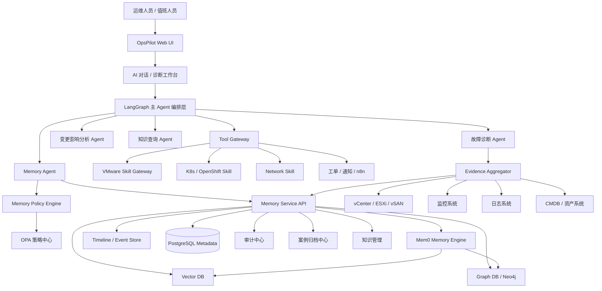
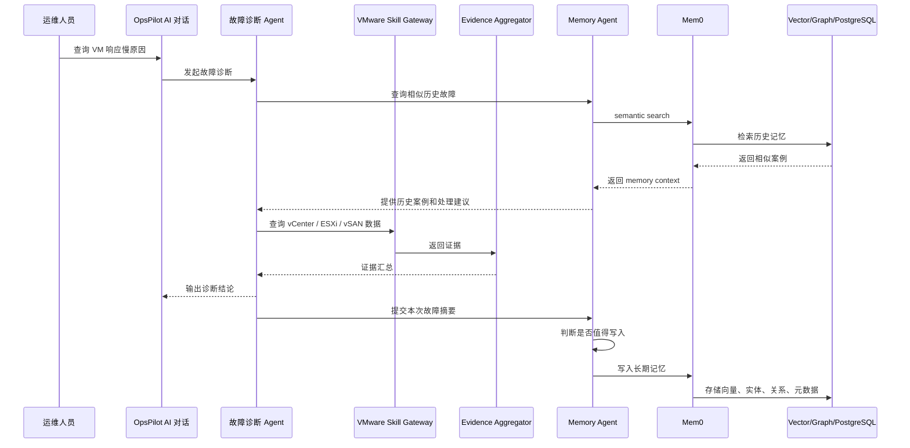

---

# 1. OpsPilot Memory 企业级架构图



---

# 2. Memory 分层模型

OpsPilot 的长期记忆不要只做向量库，应分为 5 类。

| 记忆类型 | 说明                      | 示例                                      |
| ---- | ----------------------- | --------------------------------------- |
| 用户记忆 | 用户偏好、处理习惯、审批偏好          | “张三习惯先看 vSAN 延迟再看主机负载”                  |
| 资源记忆 | VMware / K8s / 网络资源历史画像 | “cluster-prod-01 经常在月末 CPU 峰值高”         |
| 故障记忆 | 历史故障、根因、处理动作、结果         | “ESXi-07 曾因内存硬件告警触发 HA”                 |
| 变更记忆 | 变更窗口、变更影响、回滚经验          | “上次升级 NSX Edge 后出现东西向流量异常”              |
| 知识记忆 | KB、经验、SOP、专家规则          | “vSAN frontend write latency 高时优先检查磁盘组” |

---

# 3. Memory Agent 设计

## 3.1 Agent 定位

Memory Agent 是 OpsPilot 的长期记忆子系统，不直接执行运维动作，只负责：

```text
1. 判断哪些信息值得写入长期记忆
2. 对记忆进行结构化抽取
3. 判断记忆类型、优先级、保留周期
4. 提供按上下文检索的历史经验
5. 对重复、冲突、过期记忆进行合并或降权
6. 为故障诊断 Agent 提供历史相似案例
7. 为变更影响分析 Agent 提供历史影响依据
```

---

## 3.2 Memory Agent 输入

```json
{
  "request_id": "req-20260428-0001",
  "tenant_id": "default",
  "user_id": "ops_user_001",
  "session_id": "chat_001",
  "source": "diagnosis_agent",
  "input_type": "incident_summary",
  "content": {
    "incident_id": "INC-20260428-001",
    "resource_type": "vmware.vm",
    "resource_id": "vm-12345",
    "resource_name": "app-prod-01",
    "symptom": "虚拟机响应慢，业务访问超时",
    "evidence": [
      "vSAN frontend write latency 持续超过 80ms",
      "所在 ESXi 主机 CPU ready 正常",
      "datastore latency 异常",
      "最近 30 分钟无 vMotion"
    ],
    "root_cause": "vSAN 磁盘组写入延迟异常",
    "actions": [
      "切换业务流量",
      "检查磁盘组健康状态",
      "重启异常磁盘控制器对应主机服务"
    ],
    "result": "业务恢复"
  }
}
```

---

## 3.3 Memory Agent 输出

```json
{
  "request_id": "req-20260428-0001",
  "should_write_memory": true,
  "memory_type": "incident_memory",
  "importance": "high",
  "confidence": 0.91,
  "retention_policy": "long_term",
  "memory_items": [
    {
      "title": "app-prod-01 曾因 vSAN 写入延迟导致业务访问超时",
      "summary": "2026-04-28，app-prod-01 出现业务访问超时，证据显示 vSAN frontend write latency 持续超过 80ms，最终判断为 vSAN 磁盘组写入延迟异常。",
      "entities": [
        {
          "type": "vm",
          "name": "app-prod-01",
          "id": "vm-12345"
        },
        {
          "type": "datastore",
          "name": "vsanDatastore"
        }
      ],
      "tags": [
        "vmware",
        "vsan",
        "latency",
        "incident",
        "root-cause"
      ],
      "root_cause": "vSAN 磁盘组写入延迟异常",
      "resolution": "切换业务流量后检查磁盘组健康状态，业务恢复",
      "evidence_refs": [
        "evidence-001",
        "evidence-002"
      ]
    }
  ]
}
```

---

# 4. Memory Agent Prompt 模板

## 4.1 System Prompt

```text
你是 OpsPilot 的 Memory Agent，负责管理企业运维长期记忆。

你的职责不是直接诊断故障，也不是执行运维操作，而是判断输入内容中哪些信息具有长期价值，并将其结构化为可检索、可审计、可治理的记忆。

你必须遵守以下原则：

1. 只保存对未来运维有价值的信息。
2. 不保存无意义的临时对话。
3. 不保存敏感凭据、密码、Token、密钥。
4. 不保存未经确认的猜测作为事实。
5. 对低置信度信息必须标记 confidence。
6. 记忆必须包含来源、时间、实体、标签和保留策略。
7. 故障类记忆必须尽量包含：现象、影响范围、证据、根因、处理动作、结果。
8. 如果存在相似历史记忆，应建议合并、更新或降权。
9. 输出必须严格符合 JSON Schema。
```

---

## 4.2 User Prompt 模板

```text
请分析以下 OpsPilot 上下文，判断是否应该写入长期记忆。

上下文类型：
{{input_type}}

来源：
{{source}}

用户：
{{user_id}}

租户：
{{tenant_id}}

内容：
{{content}}

请输出：
1. 是否需要写入长期记忆
2. 记忆类型
3. 重要程度
4. 置信度
5. 保留策略
6. 结构化 memory_items
7. 是否需要和已有记忆合并
```

---

# 5. Memory Schema 设计

## 5.1 核心表：memory_item

```sql
CREATE TABLE memory_item (
    id UUID PRIMARY KEY,
    tenant_id VARCHAR(128) NOT NULL,
    user_id VARCHAR(128),
    memory_type VARCHAR(64) NOT NULL,
    title TEXT NOT NULL,
    summary TEXT NOT NULL,
    content JSONB NOT NULL,
    source VARCHAR(128) NOT NULL,
    source_id VARCHAR(128),
    importance VARCHAR(32) NOT NULL,
    confidence NUMERIC(4,3) NOT NULL,
    retention_policy VARCHAR(64) NOT NULL,
    status VARCHAR(32) DEFAULT 'active',
    created_at TIMESTAMP NOT NULL DEFAULT now(),
    updated_at TIMESTAMP NOT NULL DEFAULT now(),
    expire_at TIMESTAMP NULL
);
```

---

## 5.2 实体表：memory_entity

```sql
CREATE TABLE memory_entity (
    id UUID PRIMARY KEY,
    memory_id UUID NOT NULL REFERENCES memory_item(id),
    entity_type VARCHAR(64) NOT NULL,
    entity_id VARCHAR(128),
    entity_name VARCHAR(256),
    properties JSONB
);
```

---

## 5.3 标签表：memory_tag

```sql
CREATE TABLE memory_tag (
    id UUID PRIMARY KEY,
    memory_id UUID NOT NULL REFERENCES memory_item(id),
    tag VARCHAR(128) NOT NULL
);
```

---

## 5.4 证据关联表：memory_evidence_ref

```sql
CREATE TABLE memory_evidence_ref (
    id UUID PRIMARY KEY,
    memory_id UUID NOT NULL REFERENCES memory_item(id),
    evidence_id VARCHAR(128) NOT NULL,
    evidence_type VARCHAR(64),
    evidence_uri TEXT
);
```

---

# 6. Memory API 设计

## 6.1 写入记忆

```http
POST /api/v1/memories
```

```json
{
  "tenant_id": "default",
  "user_id": "ops_user_001",
  "memory_type": "incident_memory",
  "title": "app-prod-01 曾因 vSAN 写入延迟导致业务访问超时",
  "summary": "app-prod-01 出现业务访问超时，根因为 vSAN 磁盘组写入延迟异常。",
  "content": {
    "symptom": "业务访问超时",
    "root_cause": "vSAN 磁盘组写入延迟异常",
    "resolution": "切换业务流量并检查磁盘组健康状态"
  },
  "entities": [
    {
      "entity_type": "vm",
      "entity_id": "vm-12345",
      "entity_name": "app-prod-01"
    }
  ],
  "tags": [
    "vmware",
    "vsan",
    "latency"
  ],
  "importance": "high",
  "confidence": 0.91,
  "retention_policy": "long_term"
}
```

---

## 6.2 查询相似记忆

```http
POST /api/v1/memories/search
```

```json
{
  "tenant_id": "default",
  "query": "虚拟机响应慢，vSAN 写延迟高",
  "filters": {
    "memory_type": "incident_memory",
    "tags": [
      "vmware",
      "vsan"
    ],
    "entity_type": "vm"
  },
  "top_k": 5
}
```

---

## 6.3 根据资源查询历史记忆

```http
GET /api/v1/resources/{resource_type}/{resource_id}/memories
```

示例：

```http
GET /api/v1/resources/vm/vm-12345/memories
```

---

## 6.4 合并记忆

```http
POST /api/v1/memories/{memory_id}/merge
```

```json
{
  "target_memory_id": "mem-002",
  "merge_reason": "同一虚拟机相同故障根因的重复记忆",
  "merge_strategy": "append_evidence"
}
```

---

# 7. Mem0 + VMware 故障记忆落地方案

## 7.1 整体流程



---

## 7.2 VMware 故障记忆写入规则

| 场景             | 是否写入 | 原因            |
| -------------- | ---: | ------------- |
| 已确认根因的生产故障     |    是 | 对后续 RCA 有高价值  |
| 误报、无影响告警       |   可选 | 可用于降噪         |
| 临时查询 VM 状态     |    否 | 没有长期价值        |
| 重大变更后异常        |    是 | 可用于变更影响分析     |
| 重复出现的 vSAN 延迟  |    是 | 可用于趋势判断       |
| HA 重启事件        |    是 | 影响主机、VM、业务连续性 |
| vMotion 普通迁移记录 |  通常否 | 除非与故障相关       |
| ESXi 硬件告警      |    是 | 对未来故障预测有价值    |

---

## 7.3 VMware 故障记忆字段

```json
{
  "memory_type": "vmware_incident_memory",
  "incident": {
    "incident_id": "INC-20260428-001",
    "severity": "P2",
    "start_time": "2026-04-28T10:00:00+09:00",
    "end_time": "2026-04-28T10:45:00+09:00",
    "status": "resolved"
  },
  "resource": {
    "vc": "vc-prod-01",
    "datacenter": "DC-01",
    "cluster": "cluster-prod-01",
    "host": "esxi-07",
    "vm": "app-prod-01",
    "datastore": "vsanDatastore"
  },
  "symptom": {
    "description": "业务访问超时，虚拟机响应慢",
    "metrics": [
      {
        "name": "vsan.frontend.write.latency",
        "value": 80,
        "unit": "ms"
      }
    ]
  },
  "evidence": [
    {
      "type": "metric",
      "name": "vSAN frontend write latency",
      "result": "持续超过阈值"
    },
    {
      "type": "event",
      "name": "VmRestartedOnAlternateHostEvent",
      "result": "未发现"
    }
  ],
  "root_cause": {
    "category": "storage",
    "description": "vSAN 磁盘组写入延迟异常",
    "confidence": 0.91
  },
  "resolution": {
    "actions": [
      "切换业务流量",
      "检查 vSAN 磁盘组健康状态",
      "确认异常磁盘控制器状态"
    ],
    "result": "业务恢复"
  },
  "lessons_learned": [
    "同类故障优先检查 vSAN 延迟和磁盘组健康",
    "不要只依据 VM CPU/Memory 判断性能瓶颈"
  ],
  "tags": [
    "vmware",
    "vsan",
    "storage",
    "latency",
    "production"
  ]
}
```

---

# 8. Codex 开发模块拆分

## 8.1 后端模块

```text
backend/
├── app/
│   ├── memory/
│   │   ├── api.py
│   │   ├── service.py
│   │   ├── schemas.py
│   │   ├── policy.py
│   │   ├── extractor.py
│   │   ├── retriever.py
│   │   ├── merger.py
│   │   └── mem0_adapter.py
│   ├── agents/
│   │   ├── memory_agent.py
│   │   ├── diagnosis_agent.py
│   │   └── change_impact_agent.py
│   ├── evidence/
│   │   └── evidence_aggregator.py
│   └── db/
│       └── models_memory.py
```

---

## 8.2 前端页面

```text
frontend/
├── pages/
│   ├── MemoryCenter.tsx
│   ├── MemoryDetail.tsx
│   ├── ResourceMemoryView.tsx
│   ├── IncidentMemoryView.tsx
│   └── MemoryPolicy.tsx
```

---

# 9. 页面设计需求

## 9.1 记忆中心

功能：

```text
1. 查看所有长期记忆
2. 按类型过滤：用户、资源、故障、变更、知识
3. 按标签过滤：vmware、vsan、ha、drs、network、storage
4. 查看记忆置信度
5. 查看来源和证据
6. 手动删除、归档、合并记忆
7. 标记记忆是否有效
```

---

## 9.2 资源记忆视图

在 VM、ESXi、Cluster、Datastore 页面中增加：

```text
历史故障
历史变更
历史性能异常
历史处理建议
相似案例
风险提示
```

---

## 9.3 故障诊断页面增强

在诊断结果旁边增加：

```text
相似历史故障
相似资源
历史根因
历史处理动作
推荐排查顺序
本次故障是否写入长期记忆
```

---

# 10. Codex 开发提示词

```text
你是资深全栈开发工程师。

请为 OpsPilot AIOps 平台实现 Memory Center 模块。

技术要求：
1. 后端使用 FastAPI。
2. 数据库使用 PostgreSQL。
3. Memory Engine 通过 mem0_adapter.py 封装，后续可替换为 Zep、Cognee 或自研 Memory Service。
4. 所有记忆写入必须经过 MemoryPolicy 校验。
5. 所有记忆必须包含 tenant_id、memory_type、summary、source、importance、confidence、retention_policy。
6. 支持按 query、tag、entity、memory_type 检索记忆。
7. 支持资源维度查询历史记忆。
8. 支持故障诊断完成后自动生成 incident_memory。
9. 前端使用 React + Tailwind + shadcn/ui。
10. 页面包括：
   - MemoryCenter
   - MemoryDetail
   - ResourceMemoryView
   - IncidentMemoryView
   - MemoryPolicy

请先生成：
1. 数据库模型
2. Pydantic Schema
3. FastAPI Router
4. MemoryService
5. Mem0Adapter
6. MemoryAgent
7. 前端页面骨架
8. VMware 故障记忆示例数据
```

---

# 11. 推荐落地优先级

| 阶段 | 内容                        | 优先级   |
| -- | ------------------------- | ----- |
| P0 | 故障诊断后写入故障记忆               | 最高    |
| P0 | 查询相似历史故障                  | 最高    |
| P1 | 资源维度记忆视图                  | 高     |
| P1 | 记忆策略管理                    | 高     |
| P2 | 记忆合并、降权、过期                | 中     |
| P2 | Graph 关系推理                | 中     |
| P3 | 多 Agent 共享 Memory Context | 中     |
| P3 | 自动经验沉淀为 SOP               | 高价值增强 |

---

# 12. 最终建议

OpsPilot V2 的 Memory 层建议这样落地：

```text
第一阶段：
PostgreSQL + Vector DB + Mem0 Adapter

第二阶段：
增加 Graph DB，沉淀资源、故障、根因、动作之间的关系

第三阶段：
引入 Memory Agent，做记忆治理、合并、降权和主动推荐
```

最小可用版本应先实现：

```text
故障完成 → 自动生成故障记忆 → 下次诊断自动检索相似案例 → 辅助 RCA
```

这就是 OpsPilot 从“会诊断”升级为“有经验”的关键能力。
